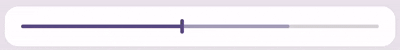
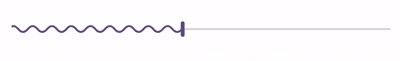

# M3E Seekbar


A Flutter package providing expressive Material 3 seekbar and media progress bar components. Features smooth spring-driven animations, Android SystemUI squiggly wave rendering (`M3EWavySeekbar`), handle shape tokens (`circle` vs `rectangle`), secondary/buffered progress tracks, rich haptics, and comprehensive customization via `M3ESeekbarDecoration`.

It provides two seekbar variants — the standard Material 3 Expressive seekbar (`M3ESeekbar`) with horizontal & vertical orientation support, and the AOSP SystemUI-inspired squiggly wave seekbar (`M3EWavySeekbar`) with phase scrolling animations and smooth playback state transitions.

---

## 🎮 Interactive Demo

You can try out the package demo here: [m3e_core demo](https://mudit200408.github.io/m3e_core/)

---

## 🚀 Features

- **Standard & Squiggly Wave Modes** — smooth linear seekbar or AOSP SystemUI squiggly wave progress bar
- **AOSP SystemUI Wave Physics** — Bezier curve waveform rendering with phase scrolling animation and amplitude transitions (800ms grow on playback, 550ms flatten on pause/scrub)
- **Dual Handle Shape Tokens** — switch seamlessly between traditional `circle` and modern M3 Expressive `rectangle` pill handles
- **Secondary / Buffered Progress** — built-in track support for media streaming and buffering indicators
- **Vertical Orientation** — full support for vertical seekbar layouts
- **Spring-driven Motion** — expressive interaction feedback powered by [motor]
- **Rich Haptic Feedback** — continuous haptic tracking and feedback levels (`light`, `medium`, `heavy`)
- **Scrubbing Label Pill** — animated floating pill indicator above the active handle during scrub
- **Keyboard Navigation** — Arrow keys, Page Up/Down, Home, End for accessible media seeking
- **Color Theming & Defaults** — comprehensive tokens via `M3ESeekbarColors` and `M3ESeekbarDefaults`
- **Full Customization** — customize track height, corner radius, handle width/height/radius, wave length, line amplitude, and phase speed

---

## 📦 Installation

> [!IMPORTANT]
> **Flutter 3.47+ & `material_ui` Requirement (v1.0.0+)**:
> Starting with `v1.0.0`, `m3e_seekbar` is migrated to use the standalone `material_ui` package decoupled in **Flutter 3.47.0**.
> - Requires Flutter SDK **`>=3.47.0`**.
> - Ensure your app imports `package:material_ui/material_ui.dart` (or run `dart fix --apply --code=migrate_design_widgets`).
> - If you are on Flutter `< 3.47.0`, please use `m3e_seekbar: ^0.0.1`.

Add `m3e_seekbar` and `material_ui` to your `pubspec.yaml`:

```yaml
dependencies:
  material_ui: ^1.0.0
  m3e_seekbar: ^1.0.0
```

```dart
import 'package:material_ui/material_ui.dart';
import 'package:m3e_seekbar/m3e_seekbar.dart';
```

---

## 🧩 Quick Start

### Standard Seekbar



```dart
M3ESeekbar(
  value: _progress,
  secondaryTrackValue: _bufferedProgress,
  onChanged: (v) => setState(() => _progress = v),
)
```

### Squiggly Wave Seekbar (AOSP SystemUI Style)



```dart
M3EWavySeekbar(
  value: _progress,
  secondaryTrackValue: _bufferedProgress,
  isPlaying: _isPlaying,
  onChanged: (v) => setState(() => _progress = v),
)
```

### Rectangular Handle Token

```dart
M3ESeekbar(
  value: _progress,
  handleShape: M3ESeekbarHandleShape.rectangle,
  onChanged: (v) => setState(() => _progress = v),
  decoration: const M3ESeekbarDecoration(
    handleWidth: 4.0,
    handleHeight: 16.0,
    trackHeight: 4.0,
  ),
)
```

### Vertical Seekbar

```dart
SizedBox(
  height: 200,
  child: M3ESeekbar(
    value: _volume,
    orientation: Axis.vertical,
    onChanged: (v) => setState(() => _volume = v),
  ),
)
```

### Custom Styled & Buffered Seekbar

```dart
M3ESeekbar(
  value: _progress,
  secondaryTrackValue: 0.85,
  label: '${(_progress * 100).round()}%',
  onChanged: (v) => setState(() => _progress = v),
  decoration: M3ESeekbarDecoration(
    handleShape: M3ESeekbarHandleShape.circle,
    handleRadius: 10.0,
    trackHeight: 6.0,
    trackCornerRadius: 3.0,
    haptic: M3EHapticFeedback.medium,
    colors: M3ESeekbarColors(
      handleColor: Colors.deepPurple,
      disabledHandleColor: Colors.deepPurple.withValues(alpha: 0.38),
      activeTrackColor: Colors.deepPurple,
      inactiveTrackColor: Colors.deepPurple.withValues(alpha: 0.16),
      disabledActiveTrackColor: Colors.grey,
      disabledInactiveTrackColor: Colors.grey.withValues(alpha: 0.12),
      secondaryTrackColor: Colors.deepPurple.withValues(alpha: 0.38),
      disabledSecondaryTrackColor: Colors.grey.withValues(alpha: 0.20),
    ),
  ),
)
```

---

## 📖 Detailed API Guide

### 1. `M3EMotion`

Spring physics configuration with 12 built-in presets and custom spring support.

#### 🏗️ Spatial Presets (Shape Morphing)
Used for animating container shape and layout transitions.

| Preset | Stiffness | Damping | Description |
|--------|-----------|---------|-------------|
| `standardSpatialFast` | `1400` | `0.9` | Snappy spring for responsive feel |
| `standardSpatialDefault` | `700` | `0.9` | Balanced spring for general use |
| `standardSpatialSlow` | `300` | `0.9` | Relaxed spring for dramatic feel |
| `expressiveSpatialFast` | `800` | `0.6` | Bouncier spring for expressive feel |
| `expressiveSpatialDefault` | `380` | `0.8` | Bouncy, balanced spring |
| `expressiveSpatialSlow` | `200` | `0.8` | Very bouncy for dramatic feel |

#### ✨ Effects Presets (Opacity/Scale)
Used for content animations like cross-fades.

| Preset | Stiffness | Damping | Description |
|--------|-----------|---------|-------------|
| `standardEffectsFast` | `3800` | `1.0` | Snappy effect animation |
| `standardEffectsDefault` | `1600` | `1.0` | Balanced effect animation |
| `standardEffectsSlow` | `800` | `1.0` | Relaxed effect animation |
| `expressiveEffectsFast` | `3800` | `1.0` | Snappy expressive effect |
| `expressiveEffectsDefault` | `1600` | `1.0` | Balanced expressive effect |
| `expressiveEffectsSlow` | `800` | `1.0` | Relaxed expressive effect |

#### 🛠️ Custom Motion

```dart
M3EMotion.custom(stiffness: 1200, damping: 0.75)
```

---

### 2. `M3EHapticFeedback`

Haptic feedback intensity levels for seekbar interactions.

| Level | Description |
|-------|-------------|
| `none` | No haptic feedback (default) |
| `light` | Light tap feedback |
| `medium` | Medium impact feedback |
| `heavy` | Heavy impact feedback |

```dart
M3ESeekbarDecoration(haptic: M3EHapticFeedback.medium)
```

---

### 3. `M3ESeekbarHandleShape`

The shape token for the seekbar handle (thumb).

| Shape | Description |
|-------|-------------|
| `circle` | Traditional circular thumb, standard for media seekbars |
| `rectangle` | Vertical pill handle with rounded corners, following Material 3 Expressive slider handle styling |

```dart
M3ESeekbar(
  value: _progress,
  handleShape: M3ESeekbarHandleShape.rectangle,
  onChanged: (v) => setState(() => _progress = v),
)
```

---

### 4. `M3ESeekbarColors`

Full color token set for seekbar components.

| Field | Type | Description |
|-------|------|-------------|
| `handleColor` | `Color` | Handle color when enabled |
| `disabledHandleColor` | `Color` | Handle color when disabled |
| `activeTrackColor` | `Color` | Track segment from start to handle |
| `inactiveTrackColor` | `Color` | Track segment from handle to end |
| `disabledActiveTrackColor` | `Color` | Active track segment when disabled |
| `disabledInactiveTrackColor` | `Color` | Inactive track segment when disabled |
| `secondaryTrackColor` | `Color` | Secondary (buffered) track segment |
| `disabledSecondaryTrackColor` | `Color` | Secondary track segment when disabled |

Use `M3ESeekbarDefaults.colors(context)` for theme-derived colors:

```dart
M3ESeekbarDecoration(
  colors: M3ESeekbarColors(
    handleColor: Colors.teal,
    disabledHandleColor: Colors.teal.withValues(alpha: 0.38),
    activeTrackColor: Colors.teal,
    inactiveTrackColor: Colors.teal.withValues(alpha: 0.16),
    disabledActiveTrackColor: Colors.teal.withValues(alpha: 0.38),
    disabledInactiveTrackColor: Colors.teal.withValues(alpha: 0.08),
    secondaryTrackColor: Colors.teal.withValues(alpha: 0.38),
    disabledSecondaryTrackColor: Colors.teal.withValues(alpha: 0.20),
  ),
)
```

---

### 5. `M3ESeekbarDecoration`

Styling, shape tokens, and wave/haptic overrides for all seekbar components.

| Parameter | Type | Default | Description |
|-----------|------|---------|-------------|
| `handleShape` | `M3ESeekbarHandleShape` | `circle` | Handle shape token (`circle` or `rectangle`) |
| `colors` | `M3ESeekbarColors?` | Theme-derived | Custom color tokens |
| `haptic` | `M3EHapticFeedback?` | `none` | Haptic feedback level during interactions |
| `hapticConfig` | `M3EHapticConfig?` | Continuous | Custom haptic vibration configuration |
| `trackHeight` | `double?` | `4.0` | Height of the seekbar track |
| `trackCornerRadius` | `double?` | `2.0` | Corner radius of the track ends |
| `handleWidth` | `double?` | `4.0` | Width of rectangular handle |
| `handleHeight` | `double?` | `16.0` | Height of rectangular handle |
| `handleRadius` | `double?` | `10.0` | Radius of circular handle |
| `waveLength` | `double?` | `20.0` | Horizontal length of squiggly sine wave |
| `lineAmplitude` | `double?` | `3.0` | Peak amplitude height of sine wave |
| `phaseSpeed` | `double?` | `16.0` | Horizontal phase scrolling speed in px/sec |
| `transitionEnabled` | `bool` | `true` | Whether amplitude smooth tapering near progress point is enabled |

```dart
M3ESeekbarDecoration(
  handleShape: M3ESeekbarHandleShape.rectangle,
  haptic: M3EHapticFeedback.light,
  trackHeight: 4.0,
  handleWidth: 4.0,
  handleHeight: 16.0,
  waveLength: 24.0,
  lineAmplitude: 4.0,
  phaseSpeed: 20.0,
)
```

---

### 6. Seekbar Widgets

#### `M3ESeekbar`

Direct drop-in replacement for Flutter's standard `Slider`, extended with Material 3 Expressive spring physics, dual handle shapes, secondary (buffered) track progress, and vertical orientation.

| Parameter | Type | Default | Description |
|-----------|------|---------|-------------|
| `value` | `double` | — | Current seekbar value |
| `onChanged` | `ValueChanged<double>?` | — | Callback while scrubbing value |
| `onChangeStart` | `ValueChanged<double>?` | — | Callback when scrub starts |
| `onChangeEnd` | `ValueChanged<double>?` | — | Callback when scrub ends |
| `min` | `double` | `0.0` | Minimum value |
| `max` | `double` | `1.0` | Maximum value |
| `secondaryTrackValue` | `double?` | — | Optional secondary progress (buffering) |
| `enabled` | `bool` | `true` | Whether the seekbar is interactive |
| `orientation` | `Axis` | `horizontal` | Layout direction (`horizontal` or `vertical`) |
| `label` | `String?` | — | Floating label pill shown above handle while scrubbing |
| `handleShape` | `M3ESeekbarHandleShape?` | — | Shortcut override for handle shape |
| `trackHeight` | `double?` | — | Shortcut override for track height |
| `trackCornerRadius` | `double?` | — | Shortcut override for track corner radius |
| `handleWidth` | `double?` | — | Shortcut override for rectangular handle width |
| `handleHeight` | `double?` | — | Shortcut override for rectangular handle height |
| `handleRadius` | `double?` | — | Shortcut override for circular handle radius |
| `activeColor` | `Color?` | — | Override for active track color |
| `inactiveColor` | `Color?` | — | Override for inactive track color |
| `secondaryActiveColor` | `Color?` | — | Override for secondary track color |
| `thumbColor` | `Color?` | — | Override for handle thumb color |
| `focusNode` | `FocusNode?` | — | Keyboard focus node |
| `autofocus` | `bool` | `false` | Whether to autofocus on build |
| `decoration` | `M3ESeekbarDecoration?` | — | Comprehensive styling and haptic configuration |

```dart
M3ESeekbar(
  value: _value,
  min: 0.0,
  max: 100.0,
  secondaryTrackValue: 65.0,
  label: '${_value.toInt()}s',
  handleShape: M3ESeekbarHandleShape.rectangle,
  onChanged: (v) => setState(() => _value = v),
  decoration: const M3ESeekbarDecoration(
    haptic: M3EHapticFeedback.light,
  ),
)
```

#### `M3EWavySeekbar`

A Material 3 Expressive Wavy Seekbar built on AOSP SystemUI `SquigglyProgress`. Oscillates smoothly during active playback and flattens to a straight line when paused or scrubbed.

| Parameter | Type | Default | Description |
|-----------|------|---------|-------------|
| `value` | `double` | — | Current seekbar value |
| `onChanged` | `ValueChanged<double>?` | — | Callback while scrubbing value |
| `onChangeStart` | `ValueChanged<double>?` | — | Callback when scrub starts |
| `onChangeEnd` | `ValueChanged<double>?` | — | Callback when scrub ends |
| `min` | `double` | `0.0` | Minimum value |
| `max` | `double` | `1.0` | Maximum value |
| `secondaryTrackValue` | `double?` | — | Optional secondary progress (buffering) |
| `enabled` | `bool` | `true` | Whether the seekbar is interactive |
| `isPlaying` | `bool` | `true` | Controls wave oscillation and amplitude grow/flatten transitions |
| `waveLength` | `double` | `20.0` | Horizontal wavelength in logical pixels |
| `lineAmplitude` | `double` | `3.0` | Peak wave amplitude height |
| `phaseSpeed` | `double` | `16.0` | Horizontal phase scrolling speed in px/sec |
| `strokeWidth` | `double` | `2.0` | Stroke width of the wave and track line |
| `transitionEnabled` | `bool` | `true` | Amplitude tapering near progress boundary |
| `height` | `double` | `36.0` | Container height |
| `handleShape` | `M3ESeekbarHandleShape?` | — | Shortcut override for handle shape |
| `trackCornerRadius` | `double?` | — | Shortcut override for track corner radius |
| `handleWidth` | `double?` | — | Shortcut override for rectangular handle width |
| `handleHeight` | `double?` | — | Shortcut override for rectangular handle height |
| `handleRadius` | `double?` | — | Shortcut override for circular handle radius |
| `activeColor` | `Color?` | — | Override for active track color |
| `inactiveColor` | `Color?` | — | Override for inactive track color |
| `secondaryActiveColor` | `Color?` | — | Override for secondary track color |
| `thumbColor` | `Color?` | — | Override for handle thumb color |
| `focusNode` | `FocusNode?` | — | Keyboard focus node |
| `autofocus` | `bool` | `false` | Whether to autofocus on build |
| `decoration` | `M3ESeekbarDecoration?` | — | Comprehensive styling and haptic configuration |

```dart
M3EWavySeekbar(
  value: _progress,
  secondaryTrackValue: _buffered,
  isPlaying: _isPlaying,
  waveLength: 20.0,
  lineAmplitude: 3.0,
  phaseSpeed: 16.0,
  strokeWidth: 2.0,
  handleShape: M3ESeekbarHandleShape.circle,
  onChanged: (v) => setState(() => _progress = v),
)
```

---

### 7. `M3ESeekbarDefaults`

Design token defaults and helper methods aligned with AOSP SystemUI specifications.

| Constant | Value | Description |
|----------|-------|-------------|
| `trackHeight` | `4.0` | Default track height |
| `strokeWidth` | `2.0` | Default stroke width for track lines |
| `circleHandleRadius` | `10.0` | Default radius for circular handles |
| `rectHandleWidth` | `4.0` | Default width for rectangular handles (AOSP 4dp) |
| `rectHandleHeight` | `16.0` | Default height for rectangular handles (AOSP 16dp) |
| `rectHandleCornerRadius` | `2.0` | Corner radius for rectangular handles |
| `handleTrackGapSize` | `4.0` | Gap between track and handle |
| `trackInsideCornerSize` | `2.0` | Corner radius of track ends facing handle |
| `waveLength` | `20.0` | AOSP Squiggly horizontal wavelength |
| `lineAmplitude` | `3.0` | AOSP Squiggly peak wave amplitude |
| `phaseSpeed` | `16.0` | AOSP Squiggly phase scrolling speed (px/s) |
| `transitionPeriods` | `1.5` | Wave amplitude drop-off distance |
| `disabledAlpha` | `0.30` | Inactive/disabled track alpha multiplier |

| Method | Returns | Description |
|--------|---------|-------------|
| `colors(context)` | `M3ESeekbarColors` | Theme-derived color tokens |

---

### 8. Accessibility & Keyboard Navigation

Both `M3ESeekbar` and `M3EWavySeekbar` support full keyboard navigation out of the box.

| Key | Action |
|-----|--------|
| ← / ↓ | Decrease value by 1% of range |
| → / ↑ | Increase value by 1% of range |
| Page Up | Increase value by 10% of range |
| Page Down | Decrease value by 10% of range |
| Home | Jump to minimum value |
| End | Jump to maximum value |

---

## 🐞 Found a bug? or ✨ You have a Feature Request?

Feel free to open an [Issue](https://github.com/Mudit200408/m3e_seekbar/issues) or [Contribute](https://github.com/Mudit200408/m3e_seekbar/pulls) to the project.

Hope You Love It!

---

## Credits

- [Motor](https://pub.dev/packages/motor) Pub Package for Expressive Animations
- Claude and Gemini for helping me with the code and documentation.

### Radhe Radhe 🙏
